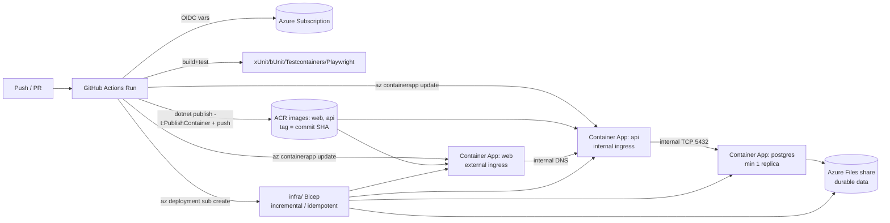

# Phase 1 Data Model: Configuration & Resource Model

This feature has no application data entities. Its "model" is the set of configuration inputs,
pipeline artifacts, and Azure resources the delivery system operates on. Entities below map to the
Key Entities in [spec.md](./spec.md).

## Configuration inputs (GitHub → pipeline)

### Repository Variables (non-secret)

| Name | Example | Purpose |
|------|---------|---------|
| `AZURE_ENV_NAME` | `tripplanner-prod` | Naming seed for the resource group and resources |
| `AZURE_LOCATION` | `eastus2` | Azure region for all resources |

### Repository/Environment Secrets

| Name | Purpose | Notes |
|------|---------|-------|
| `AZURE_CLIENT_ID` | OIDC login client id | Identifier (no client secret with OIDC); stored as a secret by preference |
| `AZURE_TENANT_ID` | OIDC/app tenant id | Also used for the app's Entra tenant |
| `AZURE_SUBSCRIPTION_ID` | Target subscription | For provisioning + deploy |
| `POSTGRES_PASSWORD` | Password for the Postgres container's superuser | Set as a Container Apps secret on `postgres` (and referenced by `api`) |
| `AZURE_ENTRA_WEB_CLIENT_ID` / `..._API_CLIENT_ID` | App registrations for Web/API auth | Injected as Container Apps secrets/env |

**Rule**: No secret is ever committed to source. Cloud auth is OIDC (no secret). Runtime secrets are
provided at deploy time and surfaced as Container Apps secrets.

## Pipeline entities

### Pipeline Run

| Field | Description |
|-------|-------------|
| trigger | `pull_request` or `push` (branch `main`) |
| commit SHA | The exact source revision under test/deploy |
| status | success / failure per job |
| artifacts | Container images (on `main`) |
| gates | build + test must pass before deploy steps run |

### Container Image

| Field | Description |
|-------|-------------|
| service | `web` or `api` |
| build | `dotnet publish -t:PublishContainer` (no Dockerfile) |
| registry | Azure Container Registry (Basic) |
| tag | commit SHA (immutable) + branch `latest` |
| provenance | traceable to the Pipeline Run / commit SHA |

### Deployment / Release

| Field | Description |
|-------|-------------|
| environment | `production` (single, for v1) |
| version | commit SHA deployed |
| revision | Container Apps revision created per `az containerapp update` |
| status | bicep-deploy → image-push → app-update → migrate → healthy / failed |
| rollback target | previous healthy revision / prior SHA image |

## Azure resource entities (provisioned by `infra/` Bicep via `az deployment`)

| Resource | SKU / Tier | Role | Notes |
|----------|------------|------|-------|
| Resource Group | — | Container for all resources | Named from `AZURE_ENV_NAME` |
| Log Analytics Workspace | PerGB2018 | Logs/metrics for Container Apps | Cheapest ingest tier |
| Container Apps Environment | Consumption | Shared runtime for all apps | Scale-to-zero capable (web/api) |
| Environment Storage (Azure Files) | Storage Account (Standard LRS) + File Share | Durable volume for Postgres data | Mounted into the `postgres` app |
| Azure Container Registry | Basic | Stores `web` + `api` images | Cheapest ACR tier |
| User-Assigned Managed Identity | — | `AcrPull` (+ Key Vault later) | No stored credentials |
| Container App: `postgres` | Consumption, **min 1 replica** | PostgreSQL database | **Internal TCP** ingress 5432; Azure Files volume mount |
| Container App: `web` | Consumption, min 0 | Blazor Web App | **External** ingress, public URL |
| Container App: `api` | Consumption, min 0 | Minimal API | **Internal** ingress only |

## Relationships



## State transitions (Deployment)

```text
queued → build → test ──(fail)──▶ failed (no deploy, notify)
                     └─(pass, main only)─▶ az deployment (bicep, incremental/idempotent)
                        → build+push web/api images (tag = SHA)
                        → az containerapp update web+api (new revisions)
                        → migrate DB (ordered SQL scripts against postgres app)
                        → health check ──(fail)──▶ keep prior revision (notify)
                                          └─(pass)─▶ healthy (new revision live)
rollback: healthy → route traffic to previous revision (or update --image :<prior-sha>)
```

## Validation rules

- All five repository variables MUST be present or the deploy job fails fast with a clear message.
- Bicep deployment MUST be incremental/idempotent: re-runs create-if-missing, no-op otherwise, and
  MUST preserve the Postgres Azure Files data across deploys.
- Deploy steps MUST NOT run for `pull_request` events or from forks.
- Image tags MUST include the immutable commit SHA (no deploy from mutable `latest` alone).
- DB migration MUST complete successfully before new app revisions receive traffic.
- The `postgres` app MUST keep min replicas = 1 and use internal-only TCP ingress.
