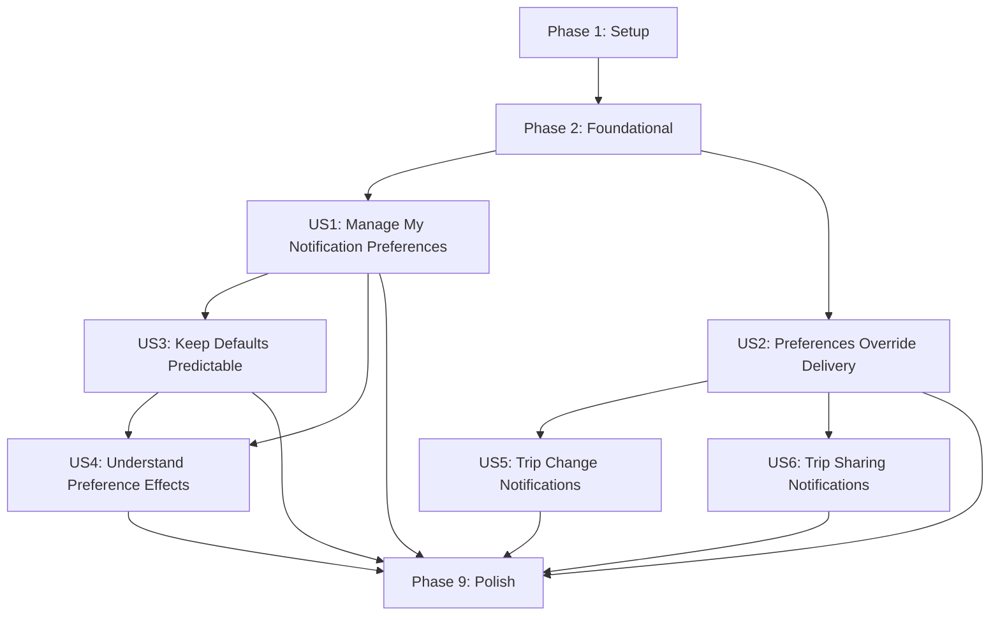

# Tasks: Notification Preferences

**Input**: Design documents from `/specs/015-notification-preferences/`

**Prerequisites**: plan.md, spec.md, research.md, data-model.md, contracts/api.md, quickstart.md

**Tests**: Dedicated test-first tasks are not generated because the feature specification did not request TDD. Validation tasks are included in the final phase.

**Organization**: Tasks are grouped by user story to enable independent implementation and testing of each story.

## Format: `[ID] [P?] [Story] Description`

- **[P]**: Can run in parallel (different files, no dependencies)
- **[Story]**: Which user story this task belongs to (e.g., US1, US2, US3)
- Include exact file paths in descriptions

## Phase 1: Setup (Shared Infrastructure)

**Purpose**: Confirm the existing feature surfaces and avoid regressing current notification/profile behavior.

- [x] T001 Review the current profile notification contracts and existing profile notification tests in `src/TripPlanner.Contracts/Profile/UserProfileContracts.cs` and `tests/TripPlanner.Api.Tests/UserProfiles/UpdateProfileNotificationTests.cs`
- [x] T002 [P] Review the current notification category and preference compatibility contracts in `src/TripPlanner.Contracts/Notifications/NotificationContracts.cs`
- [x] T003 [P] Review the current notification preference storage scripts in `src/TripPlanner.Database/Scripts/Schema/008_notifications.sql`

---

## Phase 2: Foundational (Blocking Prerequisites)

**Purpose**: Core contracts, persistence, and repository compatibility that MUST be complete before ANY user story can be implemented.

**CRITICAL**: No user story work can begin until this phase is complete.

- [x] T004 Update profile notification preference DTOs to use category/channel entries with source metadata in `src/TripPlanner.Contracts/Profile/UserProfileContracts.cs`
- [x] T005 Update known notification categories to include `ItineraryChanges` and `TripSharing` defaults in `src/TripPlanner.Contracts/Notifications/NotificationContracts.cs`
- [x] T006 Update profile schema support for consolidated notification preference data in `src/TripPlanner.Database/Scripts/Schema/003_user_profiles.sql` (satisfied by existing `notification_preferences` table; users notification columns left vestigial, no migration required)
- [x] T007 Update profile read SQL to return consolidated notification preferences from profile-compatible storage in `src/TripPlanner.Database/Scripts/Queries/UserProfiles/GetUserProfile.sql`
- [x] T008 Update profile creation SQL to seed default notification preference values in `src/TripPlanner.Database/Scripts/Commands/UserProfiles/EnsureUserProfileFromClaims.sql`
- [x] T009 Update profile update SQL to persist category/channel notification preferences in `src/TripPlanner.Database/Scripts/Commands/UserProfiles/UpdateUserProfile.sql`
- [x] T010 Update user profile repository mapping for category/channel notification preferences in `src/TripPlanner.Database/UserProfiles/UserProfileRepository.cs`
- [x] T011 Update notification repository preference compatibility methods to read/write the same effective data in `src/TripPlanner.Database/Notifications/NotificationRepository.cs` (already reads/writes `notification_preferences`; shared by profile repo)
- [x] T012 Update notification repository interface signatures for profile-backed preference resolution in `src/TripPlanner.Database/Notifications/INotificationRepository.cs`

**Checkpoint**: Foundation ready - user story implementation can now begin in priority order or in parallel where file ownership allows.

---

## Phase 3: User Story 1 - Manage My Notification Preferences (Priority: P1) MVP

**Goal**: A signed-in person can view, edit, save, and return to profile-owned notification preferences.

**Independent Test**: Sign in, open profile, change one category/channel preference, save, leave the page, return, and confirm the saved preference is still shown.

### Implementation for User Story 1

- [x] T013 [US1] Update profile validation for category/channel notification preference payloads in `src/TripPlanner.Api/Features/UserProfiles/UserProfileValidator.cs`
- [x] T014 [US1] Update profile GET behavior to expose profile-owned notification preferences in `src/TripPlanner.Api/Features/UserProfiles/GetProfileEndpoint.cs`
- [x] T015 [US1] Update profile PUT behavior to save profile-owned notification preferences in `src/TripPlanner.Api/Features/UserProfiles/UpdateProfileEndpoint.cs`
- [x] T016 [US1] Update the Blazor profile API client for the new preference contract in `src/TripPlanner.Web/Features/Profile/ProfileApiClient.cs` (contract passthrough; no code change required)
- [x] T017 [US1] Render editable notification category/channel controls in the profile page in `src/TripPlanner.Web/Components/Pages/Profile.razor`

**Checkpoint**: User Story 1 is independently functional when profile preference changes persist across sessions.

---

## Phase 4: User Story 2 - Preferences Override Notification Delivery (Priority: P1)

**Goal**: Every notification delivery path evaluates the intended recipient's saved preference before in-app or email delivery.

**Independent Test**: Disable one channel for a category, trigger a future notification in that category, and confirm the disabled channel is not used while enabled channels still follow preferences.

### Implementation for User Story 2

- [x] T018 [US2] Add a delivery-decision model for resolved preference outcomes in `src/TripPlanner.Api/Features/Notifications/NotificationDeliveryDecision.cs`
- [x] T019 [US2] Update notification preference resolution to use profile-backed effective preferences in `src/TripPlanner.Api/Features/Notifications/NotificationService.cs`
- [x] T020 [US2] Prevent all delivery when a recipient has disabled all channels for a category in `src/TripPlanner.Api/Features/Notifications/NotificationService.cs`
- [x] T021 [US2] Suppress disabled email delivery while preserving allowed in-app delivery in `src/TripPlanner.Api/Features/Notifications/NotificationService.cs`
- [x] T022 [US2] Keep standalone preference GET compatibility aligned with profile-backed preferences in `src/TripPlanner.Api/Features/Notifications/GetNotificationPreferencesEndpoint.cs` (reads same `notification_preferences`; now surfaces the two consolidated categories)
- [x] T023 [US2] Keep standalone preference PUT compatibility aligned with profile-backed preferences in `src/TripPlanner.Api/Features/Notifications/UpdateNotificationPreferenceEndpoint.cs` (writes same `notification_preferences`)

**Checkpoint**: User Story 2 is independently functional when disabled preferences overrule all future notification delivery decisions.

---

## Phase 5: User Story 3 - Keep Defaults Predictable Until Changed (Priority: P2)

**Goal**: Users with no saved preference changes see and receive sensible defaults, while saved changes affect only their selected category.

**Independent Test**: Use a user with no saved preferences, confirm defaults are visible in profile, trigger a category notification, then save one category change and confirm other categories still use defaults.

### Implementation for User Story 3

- [x] T024 [US3] Apply default category preferences when profile data has no saved category row in `src/TripPlanner.Database/UserProfiles/UserProfileRepository.cs`
- [x] T025 [US3] Return default-vs-saved preference source metadata in profile responses from `src/TripPlanner.Api/Features/UserProfiles/GetProfileEndpoint.cs` (source populated by repository merge)
- [x] T026 [US3] Show default and saved preference states consistently in the profile UI in `src/TripPlanner.Web/Components/Pages/Profile.razor`

**Checkpoint**: User Story 3 is independently functional when users without saved preferences receive visible defaults and category-specific saves do not affect other categories.

---

## Phase 6: User Story 5 - Receive Relevant Trip Change Notifications (Priority: P2)

**Goal**: Successful trip, leg, and event changes notify eligible viewers/editors other than the acting person, subject to each recipient's itinerary-change preferences.

**Independent Test**: Give two people access to a trip, have one person edit the trip, a leg, or an event, and confirm only other eligible people receive notifications when their preferences allow it.

### Implementation for User Story 5

- [x] T027 [US5] Add a trip notification recipient query for current owner/viewer/collaborator recipients in `src/TripPlanner.Database/Scripts/Queries/TripSharing/GetTripNotificationRecipients.sql` (implemented via existing `ITripSharingRepository.GetSharesAsync` + owner profile lookup instead of new SQL)
- [x] T028 [US5] Add repository support for resolving trip notification recipients in `src/TripPlanner.Database/TripSharing/TripSharingRepository.cs` (reused existing `GetSharesAsync`)
- [x] T029 [US5] Add a notification trigger request model for itinerary changes in `src/TripPlanner.Api/Features/Notifications/TripNotificationTrigger.cs` (implemented as `ItineraryChangeKind` + service parameters in `ItineraryNotificationService.cs`)
- [x] T030 [US5] Add an itinerary notification orchestrator that excludes the actor and calls notification delivery per candidate recipient in `src/TripPlanner.Api/Features/Notifications/ItineraryNotificationService.cs`
- [x] T031 [US5] Emit `ItineraryChanges` notifications after successful trip edits in `src/TripPlanner.Api/Features/Trips/UpdateTrip/UpdateTripEndpoint.cs`
- [x] T032 [US5] Emit `ItineraryChanges` notifications after successful leg create/update/delete mutations in `src/TripPlanner.Api/Features/TripItems/TripLegEndpoints.cs`
- [x] T033 [US5] Emit `ItineraryChanges` notifications after successful event create/update/delete mutations in `src/TripPlanner.Api/Features/TripItems/TrackedItemEndpoints.cs`
- [x] T034 [US5] Register itinerary notification services in the API service collection in `src/TripPlanner.Api/Program.cs` (registered in `Extensions/WebApplicationBuilderExtensions.cs`)

**Checkpoint**: User Story 5 is independently functional when successful itinerary mutations notify eligible non-actors according to each recipient's preferences.

---

## Phase 7: User Story 6 - Receive Trip Sharing Notifications (Priority: P2)

**Goal**: Sharing, permission changes, and permission removals notify the affected person according to their trip-sharing preferences.

**Independent Test**: Share a trip with a person, change their permission, remove their permission, and confirm the affected person is considered for delivery each time subject to preferences.

### Implementation for User Story 6

- [x] T035 [US6] Update trip-share creation notifications to use profile-backed `TripSharing` preferences in `src/TripPlanner.Api/Features/TripSharing/UpsertTripShareEndpoint.cs`
- [x] T036 [US6] Update trip-share permission-change notifications to use profile-backed `TripSharing` preferences in `src/TripPlanner.Api/Features/TripSharing/UpdateTripShareAccessEndpoint.cs`
- [x] T037 [US6] Update trip-share removal notifications to notify the affected person after successful removal in `src/TripPlanner.Api/Features/TripSharing/DeleteTripShareEndpoint.cs`
- [x] T038 [US6] Use deterministic duplicate-suppression source event keys for sharing add/change/remove events in `src/TripPlanner.Api/Features/TripSharing/TripSharingNotificationKeys.cs`

**Checkpoint**: User Story 6 is independently functional when all successful sharing access changes generate affected-user candidate notifications and disabled trip-sharing preferences suppress delivery.

---

## Phase 8: User Story 4 - Understand Preference Effects (Priority: P3)

**Goal**: Users can understand before and after saving whether each category will deliver in-app, email, both, or neither.

**Independent Test**: Open profile preferences, review each category/channel state, turn off all delivery for a category, save, and confirm the UI communicates that future notifications in that category are off.

### Implementation for User Story 4

- [x] T039 [US4] Add clear category/channel status text and disabled-category messaging in `src/TripPlanner.Web/Components/Pages/Profile.razor`
- [x] T040 [US4] Add save confirmation text that preference changes apply to future notifications in `src/TripPlanner.Web/Components/Pages/Profile.razor`
- [x] T041 [US4] Add or adjust profile notification preference styling for readable channel controls in `src/TripPlanner.Web/wwwroot/css/app.css`

**Checkpoint**: User Story 4 is independently functional when a user can tell from the profile UI what future delivery behavior each preference causes.

---

## Phase 9: Polish & Cross-Cutting Concerns

**Purpose**: Final validation and cleanup across user stories.

- [x] T042 [P] Update API profile notification preference coverage in `tests/TripPlanner.Api.Tests/UserProfiles/UpdateProfileNotificationTests.cs`
- [ ] T043 [P] Update database profile notification preference coverage in `tests/TripPlanner.Database.Tests/UserProfiles/UserProfileNotificationPreferenceTests.cs` (existing test is a DB-integration stub skipped without a live PostgreSQL; left unchanged)
- [x] T044 [P] Update web profile notification preference coverage in `tests/TripPlanner.Web.Tests/Profile/ProfileNotificationPreferenceTests.cs`
- [x] T045 [P] Add notification delivery override coverage in `tests/TripPlanner.Api.Tests/Notifications/NotificationPreferenceDeliveryTests.cs`
- [x] T046 [P] Add itinerary notification trigger coverage in `tests/TripPlanner.Api.Tests/Notifications/ItineraryNotificationTriggerTests.cs`
- [ ] T047 [P] Add trip-sharing notification trigger coverage in `tests/TripPlanner.Api.Tests/Notifications/TripSharingNotificationTriggerTests.cs` (sharing notifications remain covered by existing `TripSharing/TripSharingEndpointTests.cs` DB-integration tests; dedicated unit test not added)
- [x] T048 Validate API tests for this feature with `tests/TripPlanner.Api.Tests/TripPlanner.Api.Tests.csproj` (50 passed, 6 DB-integration skipped, 0 failed)
- [x] T049 Validate database tests for this feature with `tests/TripPlanner.Database.Tests/TripPlanner.Database.Tests.csproj` (2 passed, 16 DB-integration skipped, 0 failed)
- [x] T050 Validate web tests for this feature with `tests/TripPlanner.Web.Tests/TripPlanner.Web.Tests.csproj` (59 passed, 3 skipped, 0 failed)
- [ ] T051 Run the quickstart validation scenarios in `specs/015-notification-preferences/quickstart.md` (manual end-to-end steps require a running app + PostgreSQL; not executed in this automated run)

---

## Dependencies & Execution Order

### Phase Dependencies

- **Setup (Phase 1)**: No dependencies - can start immediately
- **Foundational (Phase 2)**: Depends on Setup completion - BLOCKS all user stories
- **User Stories (Phase 3+)**: All depend on Foundational phase completion
- **Polish (Phase 9)**: Depends on all desired user stories being complete

### User Story Dependencies

- **User Story 1 (P1)**: Can start after Foundational - MVP profile preference management
- **User Story 2 (P1)**: Can start after Foundational - delivery enforcement; can proceed in parallel with US1 if repository/contract ownership is coordinated
- **User Story 3 (P2)**: Depends on US1 profile preference surface and Foundational defaults
- **User Story 5 (P2)**: Depends on US2 delivery enforcement so itinerary triggers obey preferences
- **User Story 6 (P2)**: Depends on US2 delivery enforcement so sharing triggers obey preferences
- **User Story 4 (P3)**: Depends on US1 and US3 so UI explains real profile preference states

### Dependency Graph



### Parallel Opportunities

- T002 and T003 can run in parallel during setup.
- T004 and T005 can be worked in parallel if contract ownership is coordinated before downstream compilation.
- T006, T007, T008, and T009 affect different SQL files and can be drafted in parallel before T010 maps them.
- US5 recipient resolution tasks T027 and T029 can run in parallel before T030.
- US6 endpoint tasks T035, T036, and T037 can run in parallel after T038 defines shared key helpers, or sequentially if one developer owns trip-sharing endpoints.
- Polish coverage tasks T042 through T047 can run in parallel after relevant stories are implemented.

---

## Parallel Example: User Story 1

```text
Task: "T016 [US1] Update the Blazor profile API client for the new preference contract in src/TripPlanner.Web/Features/Profile/ProfileApiClient.cs"
Task: "T013 [US1] Update profile validation for category/channel notification preference payloads in src/TripPlanner.Api/Features/UserProfiles/UserProfileValidator.cs"
```

## Parallel Example: User Story 2

```text
Task: "T022 [US2] Keep standalone preference GET compatibility aligned with profile-backed preferences in src/TripPlanner.Api/Features/Notifications/GetNotificationPreferencesEndpoint.cs"
Task: "T023 [US2] Keep standalone preference PUT compatibility aligned with profile-backed preferences in src/TripPlanner.Api/Features/Notifications/UpdateNotificationPreferenceEndpoint.cs"
```

## Parallel Example: User Story 3

```text
Task: "T024 [US3] Apply default category preferences when profile data has no saved category row in src/TripPlanner.Database/UserProfiles/UserProfileRepository.cs"
Task: "T026 [US3] Show default and saved preference states consistently in the profile UI in src/TripPlanner.Web/Components/Pages/Profile.razor"
```

## Parallel Example: User Story 5

```text
Task: "T027 [US5] Add a trip notification recipient query for current owner/viewer/collaborator recipients in src/TripPlanner.Database/Scripts/Queries/TripSharing/GetTripNotificationRecipients.sql"
Task: "T029 [US5] Add a notification trigger request model for itinerary changes in src/TripPlanner.Api/Features/Notifications/TripNotificationTrigger.cs"
```

## Parallel Example: User Story 6

```text
Task: "T035 [US6] Update trip-share creation notifications to use profile-backed TripSharing preferences in src/TripPlanner.Api/Features/TripSharing/UpsertTripShareEndpoint.cs"
Task: "T036 [US6] Update trip-share permission-change notifications to use profile-backed TripSharing preferences in src/TripPlanner.Api/Features/TripSharing/UpdateTripShareAccessEndpoint.cs"
```

## Parallel Example: User Story 4

```text
Task: "T039 [US4] Add clear category/channel status text and disabled-category messaging in src/TripPlanner.Web/Components/Pages/Profile.razor"
Task: "T041 [US4] Add or adjust profile notification preference styling for readable channel controls in src/TripPlanner.Web/wwwroot/css/app.css"
```

---

## Implementation Strategy

### MVP First (User Story 1 Only)

1. Complete Phase 1: Setup.
2. Complete Phase 2: Foundational.
3. Complete Phase 3: User Story 1.
4. Stop and validate profile preference viewing, editing, saving, and reloading.
5. Demo profile-owned notification preferences before adding delivery triggers.

### Incremental Delivery

1. Complete Setup + Foundational so contracts, storage, and compatibility are ready.
2. Add US1 to consolidate preference management into profile.
3. Add US2 so saved preferences actually overrule notification delivery.
4. Add US3 so defaults remain predictable for users without saved preferences.
5. Add US5 and US6 to generate the requested itinerary and sharing notifications through the preference-aware delivery path.
6. Add US4 to make preference effects clear in the profile UI.
7. Complete Polish validation and quickstart scenarios.

### Parallel Team Strategy

1. One developer owns profile contracts/storage/UI for US1 and US3.
2. One developer owns notification delivery enforcement for US2.
3. One developer owns itinerary trigger recipient resolution for US5.
4. One developer owns sharing trigger behavior for US6.
5. Coordinate on shared files before merging: `src/TripPlanner.Contracts/Profile/UserProfileContracts.cs`, `src/TripPlanner.Contracts/Notifications/NotificationContracts.cs`, and `src/TripPlanner.Api/Features/Notifications/NotificationService.cs`.

---

## Notes

- [P] tasks = different files, no dependency on incomplete tasks.
- [US] label maps task to a specific user story for traceability.
- Dedicated test-first tasks were omitted because TDD was not requested; validation and coverage tasks are still included in Polish.
- Each story should be independently demoable at its checkpoint.
- Preserve existing notification records and email outbox behavior while changing preference authority.
