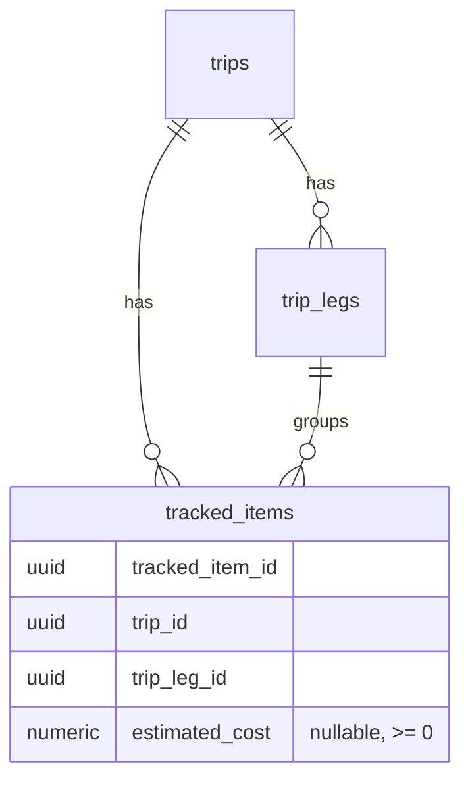

# Data Model: Estimated Expenses

**Feature**: 017-estimated-expenses | **Date**: 2026-07-10 | **Phase**: 1

This feature adds one optional persisted value to the existing tracked item and two derived (non-persisted) rollups. No new tables or entities are introduced.

## Persisted Change

### tracked_items (existing table — one new column)

| Column | Type | Null | Notes |
|--------|------|------|-------|
| `estimated_cost` | `NUMERIC(12,2)` | YES | Optional estimated cost for the item. `NULL` = no estimate recorded (excluded from totals). `0.00` = explicit zero estimate (included in totals). Non-negative. |

**Constraint**: `CHECK (estimated_cost IS NULL OR estimated_cost >= 0)`.

**Migration** (`Scripts/Schema/009_estimated_expenses.sql`):
- `ALTER TABLE tracked_items ADD COLUMN IF NOT EXISTS estimated_cost NUMERIC(12,2) NULL;`
- Add the non-negative check constraint (drop-if-exists then add, matching the pattern used for `tracked_items_notes_len_chk`).
- No backfill: existing items remain `NULL` ("no estimate"), which is the correct default.

**Validation rules** (enforced in `TrackedItemValidator`):
- If provided, `estimated_cost >= 0`; negative values are rejected with a friendly message.
- If provided, value must fit `NUMERIC(12,2)` (at most two decimal places; magnitude within the column bound); more than two decimals is normalized/rejected per FR and edge cases.
- Absent/blank input persists as `NULL` (no estimate).

## Derived (Non-Persisted) Values

### Leg Estimated Total

- **Definition**: Sum of `estimated_cost` across all tracked items whose `trip_leg_id` equals the leg, ignoring `NULL` values.
- **Empty case**: A leg with no item estimates yields `0` and is presented with a clear "no estimates" indication rather than blank.
- **Computation**: Either SQL aggregation (`SUM(estimated_cost) FILTER (WHERE trip_leg_id = ...)`) in the timeline query or an in-memory rollup after item mapping.
- **Surface**: `TimelineLeg` contract → travel leg column in `TripTimeline.razor`.

### Trip Estimated Total

- **Definition**: Sum of all leg estimated totals for the trip (equivalently, the sum of `estimated_cost` across all leg-assigned items). Equals the sum of the per-leg totals so that per-leg subtotals always add up to the trip total (SC-003).
- **Leg-unassigned (legacy) items**: Excluded, because the trip total is defined as the sum of leg totals. New events must belong to a leg, so this only affects legacy data.
- **Empty case**: A trip with no estimates yields `0`, shown as a clear "no estimates yet" indication.
- **Surface**: `TripDetail` contract → estimated total on the trip details page (`TripDetails.razor`), in a secondary position.

## Contract Field Additions

| Contract | Field | Type | Purpose |
|----------|-------|------|---------|
| `CreateTrackedItemRequest` | `EstimatedCost` | `decimal?` | Optional estimated cost on create. |
| `UpdateTrackedItemRequest` | `EstimatedCost` | `decimal?` | Optional estimated cost on update (null clears it). |
| `TrackedItemDto` | `EstimatedCost` | `decimal?` | Round-trips the stored estimate to the modal. |
| `TimelineItem` | `EstimatedCost` | `decimal?` | Item estimate available for leg rollup and display. |
| `TimelineLeg` | `EstimatedCostTotal` | `decimal` | Derived leg estimated total for the timeline leg column. |
| `TripDetail` | `EstimatedCostTotal` | `decimal` | Derived overall trip estimated total for the trip details page. |

> Field ordering: new optional/derived fields are appended to the end of each positional `record` to avoid reordering existing parameters. Derived totals default to `0`.

## State & Lifecycle

- **Create item with estimate**: `estimated_cost` stored; contributes to its leg total and the trip total.
- **Edit estimate**: New value replaces the old; totals reflect the change on next view.
- **Clear estimate**: `estimated_cost` set to `NULL`; item drops out of all totals.
- **Explicit zero**: `estimated_cost = 0.00`; item is counted (as zero) but does not change total amounts.
- **Delete item**: Row removed; its estimate no longer contributes to any total (existing cascade/delete behavior).
- **Reassign item to another leg**: The estimate moves with the item to the new leg's total; the trip total is unchanged.

## Relationships

Leg estimated total and trip estimated total are computed from `tracked_items.estimated_cost` and are not stored.
