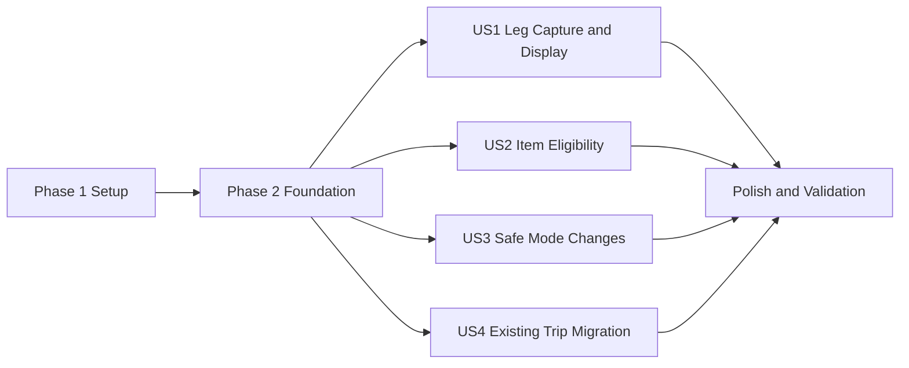

# Tasks: Travel Leg Modes and Item Eligibility

**Input**: Design documents from `/specs/025-leg-item-eligibility/`

**Prerequisites**: `plan.md`, `spec.md`, `research.md`, `data-model.md`, `contracts/api.md`, `quickstart.md`

**Tests**: Automated tests are included because each story defines an independent test and the implementation plan names xUnit, database integration, and bUnit coverage.

**Organization**: Tasks are grouped by user story so each traveler-visible increment can be implemented and validated independently after the shared foundation is complete.

## Format: `[ID] [P?] [Story] Description`

- **[P]**: Can run in parallel because it changes different files and does not depend on another incomplete task in the phase
- **[Story]**: Maps the task to User Story 1, 2, 3, or 4
- Every task names the exact file or files it changes

## Phase 1: Setup (Shared Test Infrastructure)

**Purpose**: Establish reusable feature fixtures before contracts and behavior change.

- [X] T001 [P] Create API test builders for Stay, Car, Flight, Train, Bus, and Boat leg requests and DTOs in tests/TripPlanner.Api.Tests/TripItems/TripLegModeTestData.cs
- [X] T002 [P] Create bUnit test builders for classified trip legs and timeline legs in tests/TripPlanner.Web.Tests/TripItems/TripLegModeTestData.cs

---

## Phase 2: Foundational (Blocking Prerequisites)

**Purpose**: Add the shared domain vocabulary, persistence shape, and race-safe database invariants used by every story.

**CRITICAL**: No user story work begins until this phase is complete.

- [X] T003 Add `TripLegKinds`, `TransportationModes`, mode-based `CanContainItems`, and the new leg request fields to src/TripPlanner.Contracts/TripItems/TripItemContracts.cs
- [X] T004 [P] Add `LegKind`, `TransportationMode`, `TravelCost`, `ConfirmationCode`, and derived `CanContainItems` to `TripLegDto` in src/TripPlanner.Contracts/Trips/TripContracts.cs
- [X] T005 [P] Add classification, mode, booking details, travel cost, and derived eligibility to `TimelineLeg` in src/TripPlanner.Contracts/Timeline/TimelineContracts.cs
- [X] T006 Create schema migration with origin-based Stay/Travel-Car backfill, row constraints, restricted-leg item-write trigger, and populated-leg mode-transition trigger in src/TripPlanner.Database/Scripts/Schema/014_trip_leg_modes.sql
- [X] T007 Update leg insert, update, and select sections for the new persisted fields in src/TripPlanner.Database/Scripts/Commands/TripLegs/UpsertAndDeleteTripLegs.sql
- [X] T008 Update Dapper parameters and mappings for classified legs and optional booking details in src/TripPlanner.Database/TripItems/TripItemRepository.cs

**Checkpoint**: Contracts compile, migration `014` produces only valid leg shapes, and PostgreSQL is the final authority for item eligibility and concurrent mode changes.

---

## Phase 3: User Story 1 - Describe a Travel or Stay Leg (Priority: P1) MVP

**Goal**: Travelers can create, reopen, view, edit, and print Stay legs and all five Travel modes with optional cost and confirmation details.

**Independent Test**: Create one leg for each Travel mode and one Stay leg, both with and without optional booking details, then reopen and print them to verify all applicable values persist and invalid supplied values are refused.

### Tests for User Story 1

- [X] T009 [P] [US1] Add create/update contract tests for kind, mode, route, optional cost/confirmation, and invalid supplied booking values in tests/TripPlanner.Api.Tests/TripItems/TripLegEndpointTests.cs
- [X] T010 [P] [US1] Add bUnit tests for conditional Stay/Travel fields, all five modes, optional booking fields, and edit hydration in tests/TripPlanner.Web.Tests/TripItems/TripLegFormTests.cs
- [X] T011 [P] [US1] Add timeline rendering tests for classification, mode, route, booking details, and separate travel cost in tests/TripPlanner.Web.Tests/Timeline/TripTimelineTests.cs
- [X] T012 [P] [US1] Add print rendering and formatting tests for travel mode, booking details, and travel cost in tests/TripPlanner.Web.Tests/Trips/TripPrintDocumentTests.cs and tests/TripPlanner.Web.Tests/Trips/TripPrintFormattingTests.cs

### Implementation for User Story 1

- [X] T013 [US1] Validate kind/mode combinations, Travel origin/destination, Stay field clearing, and optional booking-field bounds in src/TripPlanner.Api/Features/TripItems/TripLegValidator.cs
- [X] T014 [US1] Map create/update validation outcomes and normalized leg values through src/TripPlanner.Api/Features/TripItems/TripLegEndpoints.cs
- [X] T015 [US1] Persist and hydrate classification, mode, optional cost, and confirmation in the conditional form UI in src/TripPlanner.Web/Components/TripItems/TripLegForm.razor
- [X] T016 [P] [US1] Project the new leg fields and keep item subtotal separate from travel cost in src/TripPlanner.Database/Scripts/Queries/Timeline/GetTripTimeline.sql and src/TripPlanner.Database/Timeline/TimelineRepository.cs
- [X] T017 [US1] Display leg classification, transportation mode, route, optional booking details, and travel cost in src/TripPlanner.Web/Components/Timeline/TripTimeline.razor
- [X] T018 [P] [US1] Include leg travel costs exactly once in trip estimated totals in src/TripPlanner.Api/Features/Trips/GetTripDetail/GetTripDetailEndpoint.cs
- [X] T019 [US1] Render and format Travel-leg mode, route, optional confirmation, and cost in src/TripPlanner.Web/Components/Trips/TripPrintDocument.razor and src/TripPlanner.Web/Features/Trips/TripPrintFormatting.cs

**Checkpoint**: User Story 1 is independently usable: all leg shapes round-trip through API/UI and appear correctly on timeline and print surfaces.

---

## Phase 4: User Story 2 - Add Items Only Where Stops Are Controlled (Priority: P2)

**Goal**: Stay and Car accept items; Flight, Train, Bus, and Boat neither offer nor accept item assignment through manual or email workflows.

**Independent Test**: Create valid Stay, Car, and restricted-mode legs, verify only eligible legs expose item actions or appear in selectors, and prove direct API and email confirmation attempts against restricted legs are refused while unassigned items remain supported.

### Tests for User Story 2

- [X] T020 [P] [US2] Add API tests proving Stay/Car assignment succeeds and Flight/Train/Bus/Boat assignment fails for create and update in tests/TripPlanner.Api.Tests/TripItems/TrackedItemEndpointTests.cs
- [X] T021 [P] [US2] Add matcher and review endpoint tests for eligible-only candidates and trips with zero eligible legs in tests/TripPlanner.Api.Tests/EmailIngestion/DraftPlacementMatcherTests.cs and tests/TripPlanner.Api.Tests/EmailIngestion/DraftReviewEndpointTests.cs
- [X] T022 [P] [US2] Add bUnit tests for eligible manual selectors, eligible email selectors, restricted timeline actions, and unassigned fallback in tests/TripPlanner.Web.Tests/TripItems/TrackedItemFormLegWindowTests.cs, tests/TripPlanner.Web.Tests/EmailIngestion/InboxReviewPageTests.cs, and tests/TripPlanner.Web.Tests/Timeline/TripTimelineTests.cs

### Implementation for User Story 2

- [X] T023 [US2] Reject restricted-mode `TripLegId` values after ownership lookup and before timeframe checks in src/TripPlanner.Api/Features/TripItems/TrackedItemValidator.cs
- [X] T024 [P] [US2] Filter Flight, Train, Bus, and Boat from placement candidates while retaining null-leg trip rows in src/TripPlanner.Database/Scripts/Queries/EmailIngestion/GetPlacementCandidateLegs.sql
- [X] T025 [P] [US2] Filter leg choices with the shared eligibility rule while preserving current assignments and unassigned selection in src/TripPlanner.Web/Components/TripItems/TrackedItemForm.razor
- [X] T026 [P] [US2] Filter email-review leg choices and preserve no-eligible-leg confirmation behavior in src/TripPlanner.Web/Components/EmailIngestion/DraftEditModal.razor
- [X] T027 [US2] Hide slot selection and Add item actions for restricted timeline legs while retaining those actions for Stay and Car in src/TripPlanner.Web/Components/Timeline/TripTimeline.razor

**Checkpoint**: User Story 2 is independently enforceable through UI, API, email placement, and PostgreSQL, including stale or direct requests.

---

## Phase 5: User Story 3 - Change a Leg Without Stranding Items (Priority: P3)

**Goal**: Travelers can change valid classifications and modes, but cannot turn a populated eligible leg into a restricted mode; failed changes are atomic.

**Independent Test**: Change empty legs across kinds/modes, change a populated Car leg without leaving Car, then attempt Car-to-Flight with an item and verify the entire update is refused until the item is moved or unassigned.

### Tests for User Story 3

- [X] T028 [P] [US3] Add API tests for allowed kind/mode changes, populated-leg rejection, Stay field clearing, and unchanged state after failure in tests/TripPlanner.Api.Tests/TripItems/TripLegEndpointTests.cs
- [X] T029 [P] [US3] Add PostgreSQL integration tests for concurrent item assignment versus restricted-mode transition and trigger error mapping in tests/TripPlanner.Database.Tests/TripItems/TripLegModeInvariantTests.cs
- [X] T030 [P] [US3] Add bUnit edit tests for mode switching, travel-only field clearing, optional booking details, and surfaced populated-leg errors in tests/TripPlanner.Web.Tests/TripItems/TripLegFormTests.cs

### Implementation for User Story 3

- [X] T031 [US3] Preflight populated-leg transitions and translate database invariant violations into `tripLegId` validation responses in src/TripPlanner.Api/Features/TripItems/TripLegEndpoints.cs and src/TripPlanner.Database/TripItems/TripItemRepository.cs
- [X] T032 [US3] Clear travel-only values when switching to Stay, preserve optional values when switching among Travel modes, and retain form state after refused saves in src/TripPlanner.Web/Components/TripItems/TripLegForm.razor

**Checkpoint**: User Story 3 preserves every item relationship and leg field across refused transitions, including concurrent requests.

---

## Phase 6: User Story 4 - Preserve Existing Trips (Priority: P4)

**Goal**: Existing origin-bearing legs become Travel/Car, other legs become Stay, and all item relationships and user workflows remain intact without traveler action.

**Independent Test**: Apply migration `014` to representative pre-change rows with blank, whitespace, and populated origins and assigned items, then load timeline and print projections and add another valid item to the migrated Car leg.

### Tests for User Story 4

- [X] T033 [P] [US4] Add migration integration coverage for blank-origin Stay backfill, origin-bearing Travel/Car backfill, nullable booking fields, and preserved item foreign keys in tests/TripPlanner.Database.Tests/TripItems/TripLegModeMigrationTests.cs
- [X] T034 [P] [US4] Add post-migration timeline projection coverage for classified legs, preserved items, and eligible migrated Car legs in tests/TripPlanner.Database.Tests/Timeline/TimelineQueryTests.cs

### Implementation for User Story 4

- [X] T035 [US4] Update affected leg and timeline fixture constructors for the additive contract fields in tests/TripPlanner.Api.Tests/EmailIngestion/EmailIngestionApiFactory.cs, tests/TripPlanner.Web.Tests/TripItems/TrackedItemFormTestData.cs, tests/TripPlanner.Web.Tests/Timeline/TimelineNavTestData.cs, and tests/TripPlanner.Web.Tests/Trips/TripFixtures.cs

**Checkpoint**: User Story 4 demonstrates zero data loss, deterministic backfill, and continued usability for pre-feature trips.

---

## Phase 7: Polish & Cross-Cutting Concerns

**Purpose**: Validate all integrated paths and catch contract ripple effects.

- [X] T036 Run the focused API, database, and Web test commands documented in specs/025-leg-item-eligibility/quickstart.md and resolve only feature-related failures
- [X] T037 Build TripPlanner.slnx and update any remaining `TripLegDto` or `TimelineLeg` call sites reported by the compiler
- [X] T038 Execute all five manual validation scenarios and record results in specs/025-leg-item-eligibility/quickstart.md

---

## Dependencies & Execution Order

### Phase Dependencies

- **Phase 1 - Setup**: No dependencies; T001 and T002 run in parallel.
- **Phase 2 - Foundational**: Depends on Phase 1 and blocks every user story. T004 and T005 may run in parallel after T003; T007 follows T006; T008 follows T003, T004, T006, and T007.
- **Phase 3 - User Story 1**: Depends on Phase 2. Tests T009-T012 can run in parallel; implementation proceeds through validation/persistence before UI projections.
- **Phase 4 - User Story 2**: Depends on Phase 2. It can run in parallel with US1 if shared files are coordinated; T027 must wait for US1's timeline changes in T017 when both are active.
- **Phase 5 - User Story 3**: Depends on Phase 2. It can run independently of US2, but T031 follows the shared endpoint/repository work and T032 follows the base form implementation.
- **Phase 6 - User Story 4**: Depends on Phase 2. Migration verification can run in parallel with US1-US3 after migration `014` exists.
- **Phase 7 - Polish**: Depends on all stories selected for delivery.

### User Story Dependency Graph



### Within Each User Story

1. Add the story's tests and confirm they fail for the intended missing behavior.
2. Implement server/database behavior before client-only gating.
3. Implement UI projections and controls after contracts and persistence compile.
4. Run the story's focused tests before crossing its checkpoint.

## Parallel Opportunities

### User Story 1

```text
T009 API leg contract tests
T010 TripLegForm bUnit tests
T011 Timeline bUnit tests
T012 Print bUnit/formatting tests
```

After validation is implemented, T016 timeline projection and T018 trip-total calculation can proceed in parallel because they touch different files.

### User Story 2

```text
T020 Manual item API tests
T021 Email placement API tests
T022 Manual/email/timeline bUnit tests
```

After shared tests establish behavior, T024 candidate SQL, T025 manual picker filtering, and T026 email picker filtering can proceed in parallel.

### User Story 3

```text
T028 Mode-transition API tests
T029 PostgreSQL concurrency/invariant tests
T030 TripLegForm transition tests
```

### User Story 4

```text
T033 Migration/backfill integration tests
T034 Post-migration timeline projection tests
```

## Implementation Strategy

### MVP First

1. Complete Setup and Foundational phases.
2. Complete User Story 1 so explicit kinds, modes, and optional booking details round-trip and display.
3. Run T009-T019 validation and demo the leg model independently.
4. Add User Story 2 before enabling the new mode distinction in production, because eligibility is the core safety behavior.

### Incremental Delivery

1. **US1**: Persist and display accurate leg semantics.
2. **US2**: Enforce where items may be placed across all workflows.
3. **US3**: Make classification and mode correction atomic and safe.
4. **US4**: Prove existing trips migrate without data loss.
5. **Polish**: Reconcile documentation, run focused suites, build the solution, and execute the quickstart.

## Notes

- `CanContainItems` is derived from kind/mode and must not become a persisted source of truth.
- Optional cost and confirmation details are accepted for every Travel mode and validated only when supplied.
- PostgreSQL triggers are required for race safety; API validation remains responsible for clear traveler-facing errors.
- Existing item timeframe, trip ownership, sharing permissions, and unassigned-item behavior remain authoritative.
