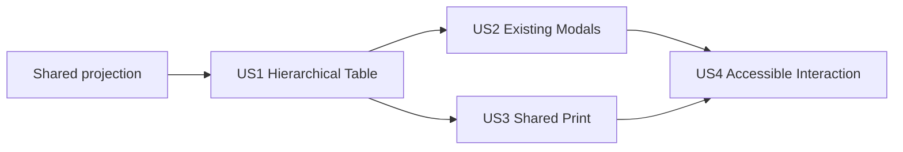

# Tasks: Editable Itinerary Table View

**Input**: Design documents from `/specs/027-table-trip-entry/`

**Prerequisites**: plan.md, spec.md, research.md, data-model.md, contracts/itinerary-table-ui.md, quickstart.md

**Tests**: Include focused projection, bUnit, integration, and browser-flow tests because the implementation plan defines these validation layers and the stories require independently verifiable hierarchy, modal reuse, print parity, permissions, and responsive accessibility.

**Organization**: Tasks are grouped by user story so each increment has a clear independent test and checkpoint.

## Format: `[ID] [P?] [Story] Description`

- **[P]**: Can run in parallel because it changes a different file and does not depend on an incomplete task
- **[Story]**: Maps the task to the corresponding user story in spec.md
- Every task names the exact file it changes

## Phase 1: Setup (Shared Test Data)

**Purpose**: Establish one representative trip fixture reused across projection, shared-table, and print-parity tests.

- [X] T001 Extend `tests/TripPlanner.Web.Tests/Trips/TripFixtures.cs` with stable IDs and a representative trip containing chronologically unordered legs, assigned items, an empty leg, a null-leg item, and an item referencing a missing leg

---

## Phase 2: Foundational (Blocking Shared Projection)

**Purpose**: Replace the print-only row model with the neutral ID-bearing projection required by every story.

**CRITICAL**: Complete this phase before user-story implementation.

- [X] T002 Add failing ordering, grouping, unmatched-item, identifier-retention, eligibility, timezone, and optional-value projection tests in `tests/TripPlanner.Web.Tests/Features/Trips/TripItineraryProjectionTests.cs`
- [X] T003 Refactor `src/TripPlanner.Web/Features/Trips/TripPrintFormatting.cs` to produce `ItineraryTableModel`, `ItineraryLegRow`, and `ItineraryItemRow` with stable IDs, existing chronological tie-breaks, formatted values, eligibility, and unassigned grouping
- [X] T004 Update existing formatting and print-model assertions for the neutral projection in `tests/TripPlanner.Web.Tests/Trips/TripPrintDocumentTests.cs`
- [X] T005 Run the focused projection and print-document tests from `tests/TripPlanner.Web.Tests/TripPlanner.Web.Tests.csproj` and resolve regressions in `src/TripPlanner.Web/Features/Trips/TripPrintFormatting.cs`

**Checkpoint**: One tested projection contains every row, identifier, formatted value, and group required by Table and Print views.

---

## Phase 3: User Story 1 - View the Itinerary as a Hierarchical Table (Priority: P1) MVP

**Goal**: Let travelers switch from Timeline to one hierarchical table with full-width leg dividers, aligned item columns, empty-leg rows, and a trailing Unassigned group.

**Independent Test**: Open a trip with multiple legs, assigned items, an empty leg, and unassigned or unmatched items; select Table and verify the complete chronological hierarchy without changing trip data.

### Tests for User Story 1

- [X] T006 [US1] Add failing bUnit tests for caption, column headers, chronological full-width leg dividers, grouped items, empty-leg rows, unassigned grouping, and empty-trip behavior in `tests/TripPlanner.Web.Tests/Trips/TripItineraryTableTests.cs`
- [X] T007 [P] [US1] Add failing trip-details tests for the default Timeline state, Timeline/Table segmented control, in-page switching, and suppression of timeline-only controls in `tests/TripPlanner.Web.Tests/Trips/TripDetailsTableViewTests.cs`

### Implementation for User Story 1

- [X] T008 [US1] Create the read-only semantic hierarchy renderer with one seven-column table and full-width row-group dividers in `src/TripPlanner.Web/Components/Trips/TripItineraryTable.razor`
- [X] T009 [P] [US1] Add neutral itinerary-table layout, divider, item-row, empty-state, and minimum-width styles in `src/TripPlanner.Web/wwwroot/css/app.css`
- [X] T010 [US1] Add page-local `Timeline`/`Table` state, segmented view controls, shared-projection rendering, and conditional timeline-only controls in `src/TripPlanner.Web/Components/Pages/Trips/TripDetails.razor`
- [X] T011 [US1] Run the US1 table-component and trip-details tests in `tests/TripPlanner.Web.Tests/TripPlanner.Web.Tests.csproj` and resolve hierarchy or view-switch regressions in `src/TripPlanner.Web/Components/Trips/TripItineraryTable.razor` and `src/TripPlanner.Web/Components/Pages/Trips/TripDetails.razor`

**Checkpoint**: Table view is a complete, read-only, independently usable itinerary alternative while Timeline behavior remains intact.

---

## Phase 4: User Story 2 - Edit Table Entries Through Existing Modals (Priority: P2)

**Goal**: Make Table view editable exclusively through the existing leg and tracked-item create/edit modals.

**Independent Test**: From Table view, invoke leg and item edits plus table-level and leg-specific add actions; verify the existing modals open with correct records or initial leg and successful saves refresh Table and Timeline data.

### Tests for User Story 2

- [X] T012 [US2] Add failing bUnit callback tests for edit-leg, edit-item, add-leg, add-item, eligible-leg preselection, restricted-leg suppression, and absent callbacks in `tests/TripPlanner.Web.Tests/Trips/TripItineraryTableTests.cs`
- [X] T013 [P] [US2] Add failing trip-details integration tests proving table actions open existing `TripLegForm` and `TrackedItemForm` modals, successful saves retain Table selection and reload data, and no inline inputs are rendered in `tests/TripPlanner.Web.Tests/Trips/TripDetailsTableViewTests.cs`

### Implementation for User Story 2

- [X] T014 [US2] Add optional ID-based edit and add callbacks with contextual native buttons and eligibility-gated leg actions in `src/TripPlanner.Web/Components/Trips/TripItineraryTable.razor`
- [X] T015 [US2] Wire table callbacks to existing modal-opening methods, add leg-prefilled item creation without clearing the supplied leg ID, and preserve Table selection through `HandleModalSavedAsync` in `src/TripPlanner.Web/Components/Pages/Trips/TripDetails.razor`
- [X] T016 [P] [US2] Add interactive action placement, hover, and focus-visible styling without introducing inline form styles in `src/TripPlanner.Web/wwwroot/css/app.css`
- [X] T017 [US2] Run the US2 component and trip-details integration tests in `tests/TripPlanner.Web.Tests/TripPlanner.Web.Tests.csproj` and resolve modal-reuse or permission regressions in `src/TripPlanner.Web/Components/Trips/TripItineraryTable.razor` and `src/TripPlanner.Web/Components/Pages/Trips/TripDetails.razor`

**Checkpoint**: Travelers can add and edit from Table view through the same forms, validation, save, cancel, eligibility, and reload workflow used by Timeline.

---

## Phase 5: User Story 3 - Share Presentation with the Printable Itinerary (Priority: P3)

**Goal**: Make Print view consume the same table renderer and projection so row hierarchy, columns, labels, order, and formatted values cannot drift.

**Independent Test**: Render the same populated and empty trips in interactive and print contexts; verify identical table structure and values while print omits all interactive actions.

### Tests for User Story 3

- [X] T018 [US3] Add failing parity tests proving `TripPrintDocument` delegates row rendering to `TripItineraryTable`, matches populated and empty table markup, and omits interactive controls in `tests/TripPlanner.Web.Tests/Trips/TripPrintDocumentTests.cs`

### Implementation for User Story 3

- [X] T019 [US3] Replace duplicated print-table markup with the callback-free shared `TripItineraryTable` while retaining trip metadata in `src/TripPlanner.Web/Components/Trips/TripPrintDocument.razor`
- [X] T020 [US3] Consolidate `.tp-print-table`, leg, item, caption, header-repeat, and page-break rules into shared itinerary-table selectors while keeping print metadata and interactive controls context-specific in `src/TripPlanner.Web/wwwroot/css/app.css`
- [X] T021 [US3] Run all print formatting, print document, print page, and itinerary table tests in `tests/TripPlanner.Web.Tests/TripPlanner.Web.Tests.csproj` and resolve shared-renderer parity regressions in `src/TripPlanner.Web/Components/Trips/TripItineraryTable.razor` and `src/TripPlanner.Web/Components/Trips/TripPrintDocument.razor`

**Checkpoint**: Screen and print have one row-rendering implementation; changing shared hierarchy or columns changes both contexts.

---

## Phase 6: User Story 4 - Use Table Entry Across Supported Devices and Access Needs (Priority: P4)

**Goal**: Preserve native table semantics, keyboard operation, view-only behavior, long-value readability, and all columns on narrow screens.

**Independent Test**: Use keyboard and assistive-technology inspection on editable and view-only trips at desktop and narrow viewports; verify contextual controls, semantics, visible focus, contained horizontal scrolling, and no overlap.

### Tests for User Story 4

- [X] T022 [US4] Add failing bUnit assertions for `scope` and row-group semantics, contextual accessible names, native button controls, viewer suppression, and labeled overflow-region attributes in `tests/TripPlanner.Web.Tests/Trips/TripItineraryTableTests.cs`
- [X] T023 [P] [US4] Add Playwright scenarios for keyboard activation, edit-modal focus flow, view-only controls, narrow-viewport horizontal reachability, long values, and no overlap in `tests/TripPlanner.E2E.Tests/TripTableViewFlowTests.cs`

### Implementation for User Story 4

- [X] T024 [US4] Add column and row-group semantics, contextual labels, viewer-safe callback gating, and a labeled table overflow region in `src/TripPlanner.Web/Components/Trips/TripItineraryTable.razor`
- [X] T025 [US4] Add contained horizontal scrolling, stable minimum column widths, overflow wrapping, visible focus, and print overflow reset styles in `src/TripPlanner.Web/wwwroot/css/app.css`
- [X] T026 [US4] Run the US4 bUnit tests in `tests/TripPlanner.Web.Tests/TripPlanner.Web.Tests.csproj` and execute the browser scenarios in `tests/TripPlanner.E2E.Tests/TripTableViewFlowTests.cs`, resolving accessibility or responsive defects in the shared table component and styles

**Checkpoint**: The table is inspectable and operable for editors and viewers across supported input methods and viewport sizes without a second responsive renderer.

---

## Phase 7: Polish & Cross-Cutting Validation

**Purpose**: Verify the complete feature against the plan, quickstart, and existing trip workflows.

- [X] T027 [P] Add a 25-leg/250-item projection and render regression case for the plan's representative performance target in `tests/TripPlanner.Web.Tests/Trips/TripItineraryTableTests.cs`
- [X] T028 [P] Update feature validation notes with completed automated and manual evidence in `specs/027-table-trip-entry/quickstart.md`
- [X] T029 Run `dotnet build TripPlanner.slnx` and the complete `tests/TripPlanner.Web.Tests/TripPlanner.Web.Tests.csproj` suite, recording only unrelated pre-existing failures in `specs/027-table-trip-entry/quickstart.md`
- [X] T030 Execute all four manual quickstart scenarios and record hierarchy, modal reuse, permissions, keyboard, narrow-viewport, and print-parity results in `specs/027-table-trip-entry/quickstart.md`

---

## Dependencies & Execution Order

### Phase Dependencies

- **Phase 1 - Setup**: No dependencies; establishes shared fixture data.
- **Phase 2 - Foundational**: Depends on T001 and blocks every user story because all views consume the shared projection.
- **Phase 3 - US1**: Depends on Phase 2; creates the shared renderer and Table view.
- **Phase 4 - US2**: Depends on US1's renderer and page integration; adds modal callbacks without changing projection rules.
- **Phase 5 - US3**: Depends on US1's shared renderer; may proceed in parallel with US2 after T008-T010 because print uses no interactive callbacks.
- **Phase 6 - US4**: Depends on US1 and the interactive controls from US2; print overflow validation also depends on US3.
- **Phase 7 - Polish**: Depends on all selected user stories.

### User Story Dependencies



- **US1 (P1)**: First independently demonstrable increment and suggested MVP.
- **US2 (P2)**: Requires the US1 table but remains independently testable through modal invocation and refresh behavior.
- **US3 (P3)**: Requires the US1 renderer, not US2; can be implemented concurrently with modal wiring.
- **US4 (P4)**: Validates the final interactive and print variants, so it follows US2 and US3.

### Within Each Story

- Add the story's failing tests before implementation.
- Implement the smallest component/page/style changes that satisfy those tests.
- Run the focused story tests before beginning the next dependent story.
- Keep forms, validation, API calls, and persistence in their existing owners.

## Parallel Opportunities

- **US1**: T007 can be authored while T006 is authored; T009 can proceed after the table class contract in T006 is established while T008 is implemented.
- **US2**: T013 can be authored in parallel with T012; T016 can proceed after callback control classes are agreed while T014-T015 are implemented.
- **US2 and US3**: After US1 passes, modal integration and print-wrapper migration touch separate owning files and can proceed concurrently, coordinating only shared component parameters.
- **US4**: T023 can be authored while T022 is authored; implementation remains ordered because T024 defines the markup styled by T025.
- **Polish**: T027 and T028 change different files and can proceed in parallel.

## Parallel Example: User Story 2 and User Story 3

```text
Developer A: T012 -> T014 -> T015 -> T017
Developer B: T018 -> T019 -> T020 -> T021
Coordinate: TripItineraryTable optional callback parameter names before T014/T019
```

## Implementation Strategy

### MVP First

1. Complete T001-T005 for the shared projection.
2. Complete T006-T011 for US1.
3. Stop and validate the hierarchical read-only Table view independently.
4. Demo or deploy the Table alternative without waiting for edit controls or print migration.

### Incremental Delivery

1. **Foundation**: Shared, ID-bearing projection with retained print behavior.
2. **US1 MVP**: Switchable, read-only hierarchical Table view.
3. **US2**: Existing modal actions make the table editable without duplicated forms.
4. **US3**: Print migrates to the same row renderer.
5. **US4**: Accessibility and responsive acceptance complete the feature.
6. **Polish**: Full build, suite, representative-scale check, and quickstart evidence.

## Notes

- No API, contract, database, package, or infrastructure tasks are required.
- `[P]` tasks operate on different files and have no dependency on unfinished tasks.
- Tests precede implementation in each phase and must initially fail for the intended missing behavior.
- The table is editable only through existing modal forms; do not add inline inputs or table-specific validation.
- Keep all seven data columns in narrow viewports through horizontal scrolling; do not hide columns or create card markup.